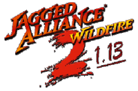

  

# JA2 v1.13 Wildfire 6.07 (Map Mod)

> This is a map mod for use with JA2 v1.13, **_not_** the standalone game Wildfire  
  
  
   
### Preamble

In the past, WF 6.07 has been hosted and updated  on a SVN, but that service stopped in 2022.   
To preserve the mod, it has been transferred to gitHub in december 2022  
The SVN had files for WF 6.06 included. Since those were stated outdated in its readme and hadn't seen any update in years, they had been removed after transfer to gitHub.  

Necessary file changes to match up with JA2 v1.13 have previously been made via SVN.   
However, the last update to SVN happened at 08.10.2020 (in old naming convention, JA2 v1.13 r8899)  
Therefore, it may occur that changes made to JA2 v1.13 inbetween are not properly reflected.  
So far, no problems have been reported related to that, but, just in case, be aware of that.  
In case of any issues, look at [Reports](#Reports) or [Participation](#Participation)  

### Downloads
 

- [WF 6.07 (map mod)](https://github.com/kitty624/JA2-v1.13-Wildfire-6.07-Map-Mod/archive/refs/heads/main.zip "WF 6.07 as zip from this gitHub repository")  
WF 6.07 as zip from this gitHub repository

- [JA2 v1.13 (latest) monthly SCI](http://thepit.ja-galaxy-forum.com/index.php?t=msg&th=24648&start=0& "Stand-in until Release Repo is set up")  
For the time being, Bear's Pit Forum "How-to-get..."-thread.  
A gitHub repository for releases is w.i.p., the link will be updated when finished.

### Installation

1. Install original Jagged Alliance 2
2. Download latest SCI and copy its content to JA2 game directory. Overwrite when asked.
3. Download WF 6.07 (Map Mod) from gitHub and copy its content to your JA2 game directory 
4. Modify Ini settings if you like.
5. Play the game.

   Some additional information on possible mod combinations and use with 7609  
   can be found in readme inside download.  

### Reports

For more information and reports, visit [Wildfire at Bear's Pit Forum](http://thepit.ja-galaxy-forum.com/index.php?t=msg&th=19409&goto=346125#msg_346125 "WF at Bear's Pit Forum") or join the [Bear's Pit Discord](https://discord.gg/GqrVZUM "Bear's Pit Discord")

### Participation 

There might be players out there that faced issues with the mod and found a solution to solve it as well.  
If that's the case for you, feel free to participate. Make a pull request or leave suggestions at "issues".  
Or simply share your thoughts on the topic on the [Bear's Pit Discord](https://discord.gg/GqrVZUM "Bear's Pit Discord")

